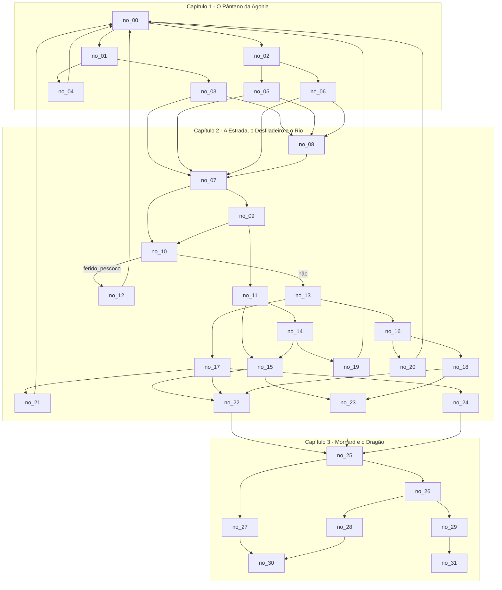

# Mapa de ramificações

> Gerado por `node tools/graph.js`. Não editar à mão.

```mermaid
flowchart TD
  subgraph cap1["Capítulo 1 - O Pântano da Agonia"]
    no_00
    no_01
    no_02
    no_03
    no_04
    no_05
    no_06
  end
  subgraph cap2["Capítulo 2 - A Estrada, o Desfiladeiro e o Rio"]
    no_07
    no_08
    no_09
    no_10
    no_11
    no_12
    no_13
    no_14
    no_15
    no_16
    no_17
    no_18
    no_19
    no_20
    no_21
    no_22
    no_23
    no_24
  end
  subgraph cap3["Capítulo 3 - Mornard e o Dragão"]
    no_25
    no_26
    no_27
    no_28
    no_29
    no_30
    no_31
  end
  no_00 --> no_01
  no_00 --> no_02
  no_01 --> no_03
  no_01 --> no_04
  no_02 --> no_05
  no_02 --> no_06
  no_03 --> no_07
  no_03 --> no_08
  no_04 --> no_00
  no_05 --> no_07
  no_05 --> no_08
  no_06 --> no_07
  no_06 --> no_08
  no_07 --> no_09
  no_07 --> no_10
  no_08 --> no_07
  no_09 --> no_11
  no_09 --> no_10
  no_10 -->|ferido_pescoco| no_12
  no_10 -->|não| no_13
  no_11 --> no_14
  no_11 --> no_15
  no_12 --> no_00
  no_13 --> no_16
  no_13 --> no_17
  no_14 --> no_15
  no_14 --> no_19
  no_15 --> no_22
  no_15 --> no_23
  no_16 --> no_18
  no_16 --> no_20
  no_17 --> no_24
  no_17 --> no_22
  no_17 --> no_21
  no_18 --> no_22
  no_18 --> no_23
  no_19 --> no_00
  no_20 --> no_00
  no_21 --> no_00
  no_22 --> no_25
  no_23 --> no_25
  no_24 --> no_25
  no_25 --> no_26
  no_25 --> no_27
  no_26 --> no_28
  no_26 --> no_29
  no_27 --> no_30
  no_28 --> no_30
  no_29 --> no_31
```
